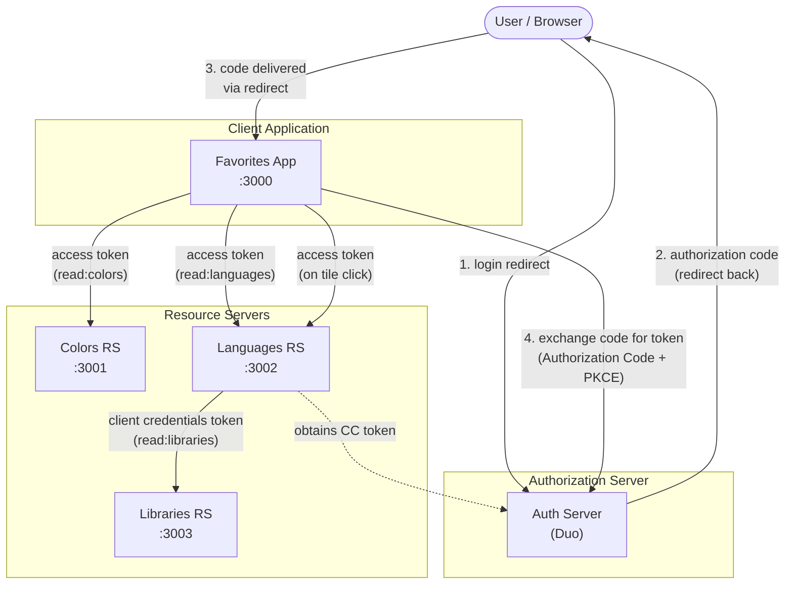

# The OAuth Playground

Playground for all kinds of OAuth specifications.

## What's Inside

This directory contains a working OAuth demo with multiple cooperating services:

- **`favorites-app/`** — Client application (`:3000`) that users interact with. Authenticates via Authorization
  Code + PKCE flow and displays the user's favorite colors, languages, and libraries.
- **`colors-resource/`** — Resource server (`:3001`) serving color data, protected by `read:colors` scope.
- **`languages-resource/`** — Resource server (`:3002`) serving per-user language data, protected by
  `read:languages` scope. Filters results based on the JWT `sub` claim.
- **`libraries-resource/`** — Resource server (`:3003`) serving library data, called by the Languages RS using
  a Client Credentials grant (machine-to-machine).
- **`start-servers.js`** — Starts all three resource servers and the client app together.

## Running

Install dependencies and start all servers with a single command:

```bash
npm install
node start-servers.js
```

This launches the Favorites App and all three resource servers. Once running, visit
[http://localhost:3000/login_duo](http://localhost:3000/login_duo) to authenticate. After login you will be
redirected to the [dashboard](http://localhost:3000/dashboard) displaying your favorites.

Press `Ctrl+C` to stop all servers.

## Architecture



## Per-User Resources

The Languages Resource Server (RS) returns only the languages mapped to the authenticated user. The user is identified
by the `sub` (subject) claim from the JWT access token — a registered claim defined in
[RFC 7519 (JWT)](https://datatracker.ietf.org/doc/html/rfc7519#section-4.1.2), not part of the core
OAuth 2.0 specification itself.

This approach works because our authorization server issues JWT access tokens that the RS can decode
locally. With opaque tokens, the RS would need to call the authorization server's
[Token Introspection](https://datatracker.ietf.org/doc/html/rfc7662) endpoint to obtain the `sub`
value — a round-trip our implementation does not currently support.

### Setup

The mapping lives in `languages-resource/user-languages.json` (git-ignored for security — `sub`
values are tied to real user identities). Copy the example file to get started:

```bash
cp languages-resource/user-languages.example.json languages-resource/user-languages.json
```

Then add your user's `sub` value (visible in the Languages RS console log when a token is validated)
and the language IDs you want that user to see:

```json
{
  "<your-sub-value>": [1, 3, 5]
}
```

Language IDs reference the `id` field in `languages-resource/languages.json`. Users not present in
the mapping receive a 403 Forbidden response.
