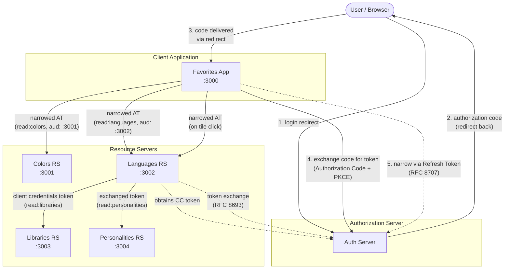

# The OAuth Playground

Playground for all kinds of OAuth specifications.

## What's Inside

This directory contains a working OAuth demo with multiple cooperating services:

- **`favorites-app/`** — Client application (`:3000`) that users interact with. Authenticates via Authorization
  Code + PKCE flow and displays the user's favorite colors, languages, and libraries.
- **`colors-resource/`** — Resource server (`:3001`) serving color data, protected by `read:colors` scope.
- **`languages-resource/`** — Resource server (`:3002`) serving per-user language data, protected by
  `read:languages` scope. Filters results based on the JWT `sub` claim.
- **`libraries-resource/`** — Resource server (`:3003`) serving library data, called by the Languages RS using
  a Client Credentials grant (machine-to-machine).
- **`personalities-resource/`** — Resource server (`:3004`) serving famous-people data per language, called by
  the Languages RS using a Token Exchange grant (RFC 8693). Unlike Libraries RS, the user's identity (`sub`)
  is preserved through the exchange, enabling per-user filtering.
- **`start-servers.js`** — Starts all four resource servers and the client app together.

## Running

Install dependencies and start all servers with a single command:

```bash
npm install
node start-servers.js
```

This launches the Favorites App and all three resource servers. Once running,
visit [http://localhost:3000/login](http://localhost:3000/login) to authenticate. After logging in, you will be
redirected to the [dashboard](http://localhost:3000/dashboard), which displays your favorites.

Press `Ctrl+C` to stop all servers.

## Architecture



## Token Narrowing (RFC 8707)

The Favorites App requests authorization for both Colors RS and Languages RS in the initial Authorization Code
flow (two `resource` parameter values). However, using a single multi-audience Access Token to call multiple
Resource Servers is a security risk: if one RS leaks the token, it can be replayed against the other.

To follow the **principle of least privilege**, the app immediately uses the Refresh Token to obtain two
**dedicated, single-audience Access Tokens** — one per RS:

- `read:colors` scoped to `http://localhost:3001` (Colors RS)
- `read:languages` scoped to `http://localhost:3002` (Languages RS)

Each RS then receives only a token intended exclusively for it. See [token-narrowing.md](docs/token-narrowing.md)
for a deeper discussion of which OAuth party is responsible for enforcing this.

## Per-User Resources

The Languages Resource Server (RS) returns only the languages mapped to the authenticated user. The user is identified
by the `sub` (subject) claim from the JWT access token — a registered claim defined in
[RFC 7519 (JWT)](https://datatracker.ietf.org/doc/html/rfc7519#section-4.1.2), not part of the core
OAuth 2.0 specification itself.

The Personalities RS also filters per user. Because the user does not call Personalities RS directly,
the Languages RS uses [Token Exchange (RFC 8693)](https://datatracker.ietf.org/doc/html/rfc8693) to
obtain a new access token for Personalities RS that preserves the original user's `sub` claim. This
contrasts with the Libraries RS call, which uses Client Credentials (no user context).

This approach works because our authorization server issues JWT access tokens that the RS can decode
locally. With opaque tokens, the RS would need to call the authorization server's
[Token Introspection](https://datatracker.ietf.org/doc/html/rfc7662) endpoint to obtain the `sub`
value — a round-trip our implementation does not currently support.

### Setup

The mapping lives in `languages-resource/user-languages.json` (git-ignored for security — `sub`
values are tied to real user identities). Copy the example file to get started:

```bash
cp languages-resource/user-languages.example.json languages-resource/user-languages.json
```

Then add your user's `sub` value (visible in the Languages RS console log when a token is validated)
and the language IDs you want that user to see:

```json
{
  "<your-sub-value>": [1, 3, 5]
}
```

Language IDs reference the `id` field in `languages-resource/languages.json`. Users not present in
the mapping receive a 403 Forbidden response.

Similarly, copy and configure the personalities mapping:

```bash
cp personalities-resource/user-personalities.example.json personalities-resource/user-personalities.json
```

Map your `sub` to the person names you want to see (names must match `personalities.json` exactly):

```json
{
  "<your-sub-value>": ["Brendan Eich", "Guido van Rossum", "Rob Pike"]
}
```
