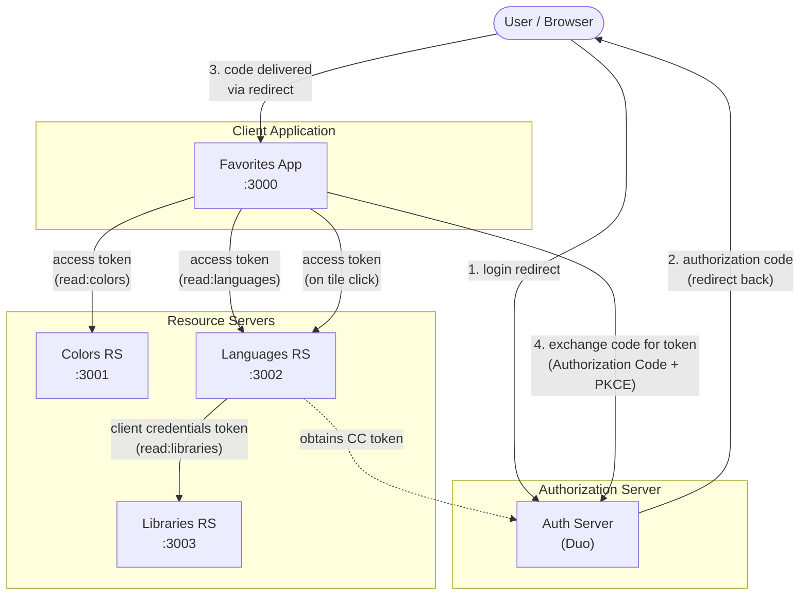

# Architecture

```mermaid
graph TB
    User([User / Browser])

    subgraph "Client Application"
        FA["Favorites App<br/>:3000"]
    end

    subgraph "Authorization Server"
        AS["Auth Server<br/>(Duo)"]
    end

    subgraph "Resource Servers"
        CR["Colors RS<br/>:3001"]
        LR["Languages RS<br/>:3002"]
        BR["Libraries RS<br/>:3003"]
    end

    User -- "1. login redirect" --> AS
    AS -- "2. authorization code<br/>(redirect back)" --> User
    User -- "3. code delivered<br/>via redirect" --> FA
    FA -- "4. exchange code for token<br/>(Authorization Code + PKCE)" --> AS

    FA -- "access token<br/>(read:colors)" --> CR
    FA -- "access token<br/>(read:languages)" --> LR
    FA -- "access token<br/>(on tile click)" --> LR

    LR -- "client credentials token<br/>(read:libraries)" --> BR
    LR -. "obtains CC token" .-> AS
```
